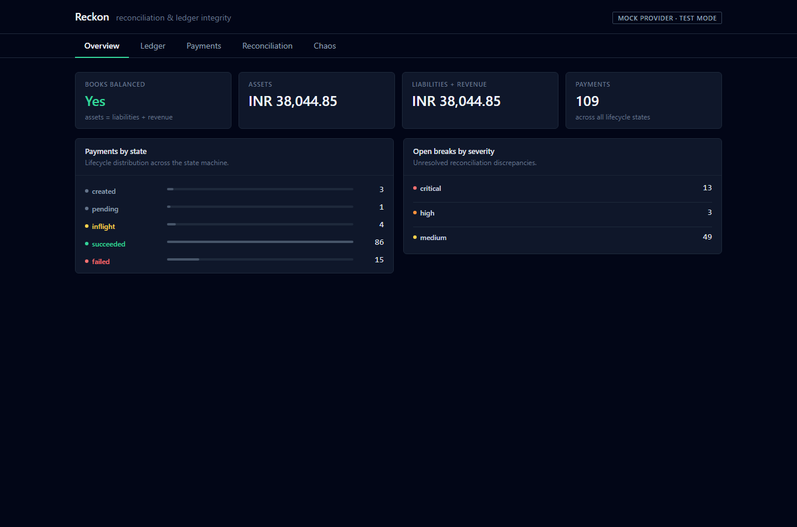
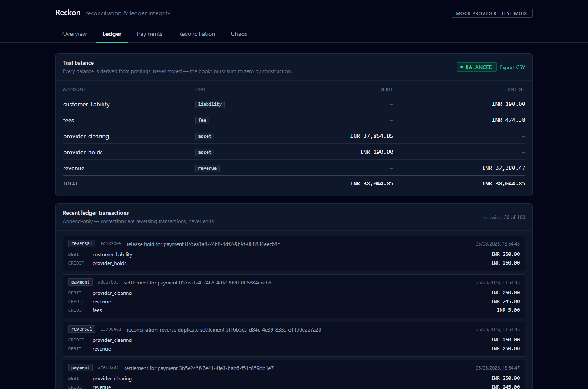
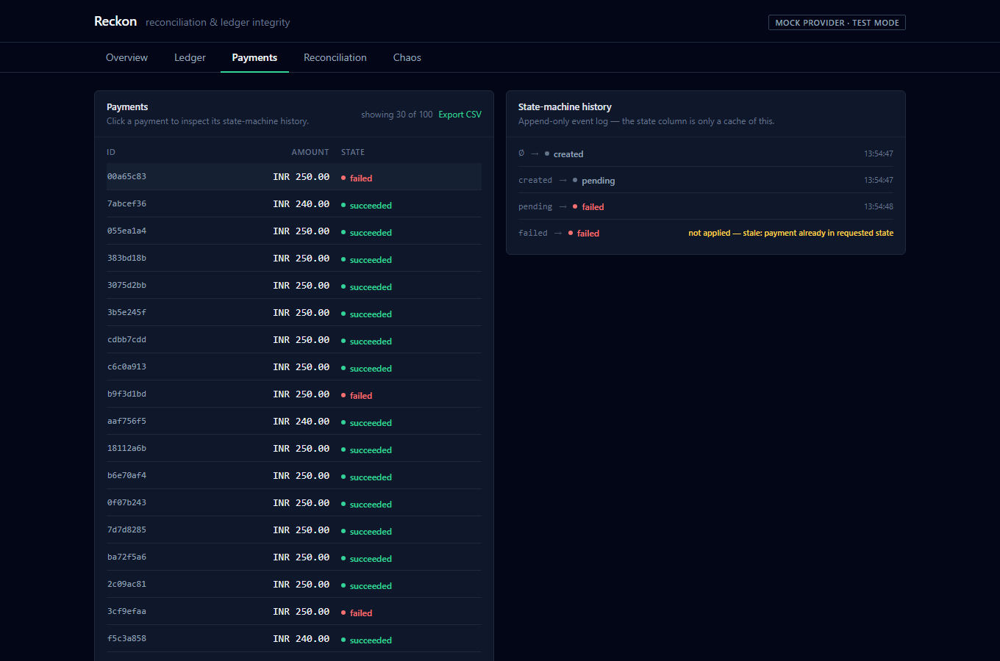
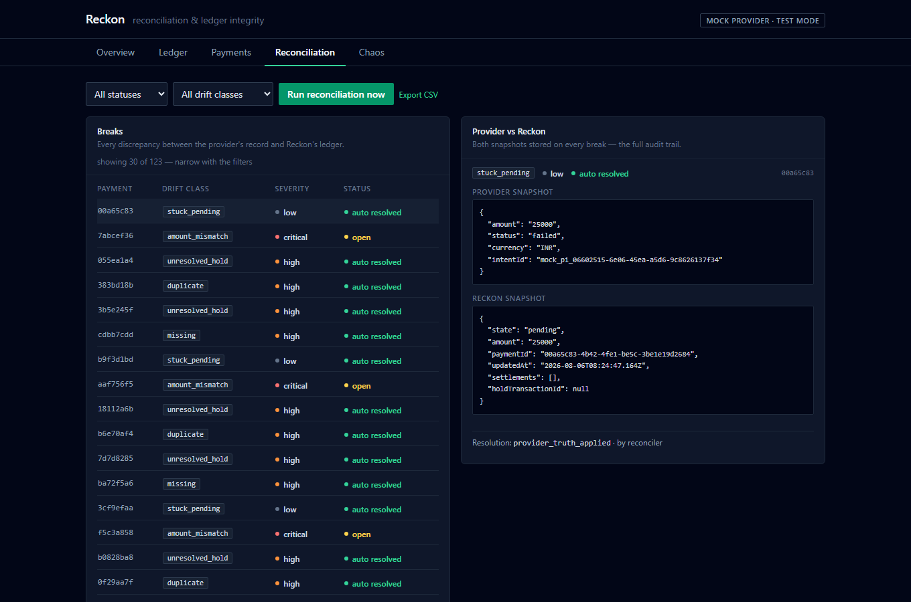
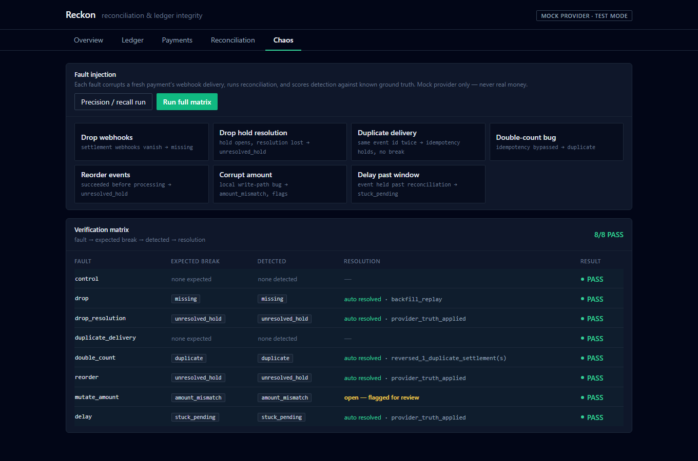
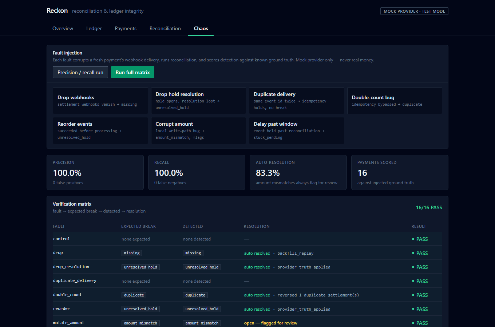

# Reckon (plain JS/CSS port)

A reconciliation and ledger-integrity engine for payments: a double-entry ledger where every movement of money is a balanced, immutable set of postings, a payment lifecycle that stays correct when webhooks arrive twice, out of order, or not at all, and a reconciliation engine that continuously checks the internal ledger against the payment provider's records. A fault-injection harness deliberately breaks delivery to verify the reconciler catches every class of drift.

This repo is a plain-JavaScript, plain-CSS port of the original TypeScript + Tailwind build — same architecture, same tests, same numbers, no TypeScript, no Tailwind.

```
                                   ┌──────────────────────────────────────────┐
  Stripe test mode                 │  Reckon engine (Node + JavaScript, ESM)  │
  or mock provider                 │                                          │
 ┌───────────────┐   webhooks     │  ┌────────────┐   same-DB-transaction    │
 │ PaymentIntents │──(signed raw──▶│  │  webhook   │──┬─ processed_events    │
 │ events.list    │    bodies)     │  │  handler   │  ├─ payment_events      │
 └───────┬───────┘                 │  └────────────┘  ├─ ledger postings     │
         │                         │        ▲         └─ outbox ─▶ worker    │
         │ provider truth          │        │ replay                         │
         ▼                         │  ┌────────────┐      ┌───────────────┐  │
 ┌───────────────┐    window diff  │  │ backfill / │      │ double-entry  │  │
 │ fault proxy    │──(drop, dup,──▶│  │ reconciler │─────▶│ ledger        │  │
 │ (chaos)        │  reorder, ...) │  └────────────┘      │ zero-sum, DB- │  │
 └───────────────┘                 │   breaks + audit     │ enforced      │  │
                                   └──────────────────────────────────────────┘
                                            │                    │
                                     React dashboard      CSV → PowerBI
                                     (plain CSS)
```

## What it does

Most payment demos stop at "payment successful." The interesting part starts there: the provider says one thing, your database says another, and at scale a small mismatch rate becomes a real financial hole. Reckon is built around that problem:

- **Money is postings, not a balance column.** Every ledger transaction's debits equal its credits, enforced in application code and by a deferred Postgres constraint trigger. Postings are append-only — a DB trigger rejects `UPDATE`/`DELETE`; corrections are new reversing transactions. Balances are always derived from postings, never stored.
- **Amounts are integer minor units (`bigint`), never floats.** `moneyFromJSON()` refuses a JS `number` argument at the boundary.
- **Exactly-once webhook processing:** raw-body HMAC signature verification, with the idempotency record, state transition, ledger write, and outbox rows all committed in one database transaction. A crash anywhere inside rolls the whole event back, so the provider's at-least-once retry is safe by construction.
- **Out-of-order delivery is a designed case.** An event that would cause an illegal state transition is recorded (`applied: false`) and left for reconciliation — never applied blindly, never dropped.
- **Six drift classes detected:** missing, duplicate, amount-mismatch, stuck-pending, unresolved hold, status/out-of-order mismatch — each stored with both the provider's and Reckon's snapshots and a resolution audit trail. Auto-resolution may only append reversing/correcting transactions, and never auto-resolves an amount mismatch.

## Results

Both tables below came from this repo running against real Postgres/Redis containers (`npm run engine:test` and `npm run chaos`), and match the original TypeScript build's numbers.

### Ledger invariants

| Property | How it's proven |
|---|---|
| Balanced transactions always commit; unbalanced never do | Property-based tests (fast-check) over random posting sets, plus a test that bypasses app-level checks to confirm the DB trigger independently rejects |
| Postings are immutable | `UPDATE`/`DELETE` attempts rejected by trigger, asserted in tests |
| Balances reconstruct from postings | Derived-balance assertions across the payment lifecycle |
| Exactly-once under duplicate delivery | Same signed event replayed 5× → one ledger transaction |
| Crash-safe idempotency | Simulated crash between business write and idempotency mark → full rollback, safe retry |

### Fault-injection verification matrix — output of `npm run chaos`

```
fault               expected break   detected         resolution                                         result
------------------  ---------------  ---------------  -------------------------------------------------  ------
control             (none)           (none)           -                                                  PASS
drop                missing          missing          auto_resolved: backfill_replay                     PASS
drop_resolution     unresolved_hold  unresolved_hold  auto_resolved: provider_truth_applied              PASS
duplicate_delivery  (none)           (none)           -                                                  PASS
double_count        duplicate        duplicate        auto_resolved: reversed_1_duplicate_settlement(s)  PASS
reorder             unresolved_hold  unresolved_hold  auto_resolved: provider_truth_applied              PASS
mutate_amount       amount_mismatch  amount_mismatch  open                                               PASS
delay               stuck_pending    stuck_pending    auto_resolved: provider_truth_applied              PASS
```

Scored against known ground truth over mixed multi-round runs: 100% precision, 100% recall, zero false positives/negatives; 83.3% of detected breaks auto-resolve — intentionally below 100%, because amount mismatches must always go to a human.

**42 automated tests passing** — `npm run engine:test`:

```
 Test Files  6 passed (6)
      Tests  42 passed (42)
```

## Screenshots

### Overview — live balance-sheet check


### Ledger — trial balance + append-only transaction log


### Payments — per-payment state-machine history


### Reconciliation — breaks with full provider-vs-Reckon audit trail


### Chaos — fault injection, verification matrix


### Chaos — precision/recall scoring


## Quick start

Requires Docker (Postgres + Redis) and Node 20+.

```bash
npm install
npm run db:up                 # postgres + redis via docker compose
npm run db:migrate
npm run db:seed               # a few demo payments

npm run engine:dev            # API on :4000
npm run dashboard:dev         # dashboard on :5173
```

Then open the dashboard and go to the **Chaos** tab: fire "drop webhooks" and watch the `missing` break appear and auto-resolve via backfill replay; fire "corrupt amount" and watch the `amount_mismatch` flag for human review while the books stay balanced on the Overview tab.

Headless equivalents:

```bash
npm --workspace @reckon/engine run chaos                 # verification matrix + precision/recall
npm --workspace @reckon/engine run reconcile -- --window 60
npm --workspace @reckon/engine run backfill -- --since 2026-08-06T00:00:00Z
npm --workspace @reckon/engine test                       # 42 tests incl. property-based invariants
```

To run against **Stripe test mode** instead of the mock: set `PROVIDER=stripe`, `STRIPE_TEST_KEY` (an `sk_test_` key — the engine refuses live keys at construction), and `STRIPE_WEBHOOK_SECRET` (from `stripe listen --print-secret`) in `packages/engine/.env`, then point `stripe listen --forward-to localhost:4000/webhooks/provider`.

## Reproducing the results yourself

```bash
# 1. Install workspace dependencies (root, engine, dashboard)
npm install

# 2. Bring up Postgres 16 + Redis 7
npm run db:up
docker compose ps                          # both containers should show "Up"

# 3. Apply the SQL migrations
npm run db:migrate

# 4. Seed a handful of demo payments (optional, but makes the dashboard non-empty)
npm run db:seed

# 5. Run the full engine test suite against real Postgres/Redis
npm run engine:test
# expect: "Test Files  6 passed (6)" and "Tests  42 passed (42)"

# 6. Run the fault-injection matrix + precision/recall scoring
npm run chaos
# expect: "matrix: all green", "precision: 100.0%", "recall: 100.0%"

# 7. Start both servers and click through the dashboard
npm run engine:dev            # separate terminal — API on :4000, Ctrl+C to stop
npm run dashboard:dev         # separate terminal — UI on :5173, Ctrl+C to stop
# open http://localhost:5173, click through Overview / Ledger / Payments /
# Reconciliation / Chaos — fire a fault on the Chaos tab and watch a break
# appear on Reconciliation and auto-resolve

# 8. Tear down when finished (frees the ports/containers)
npm run db:down
```

If step 5 or 6 fails on a fresh machine, it is almost always step 2/3 not having finished — `docker compose ps` should show both containers `Up`, and `pg_isready -U reckon` against the `postgres` container should return `accepting connections` before migrating.

## PCI scope boundary

Reckon never sees, stores, or transmits card data. The provider's hosted checkout owns the PAN end-to-end; Reckon holds only provider object IDs (PaymentIntent ids, event ids) and its own ledger records. There is no card-number-shaped column anywhere in the schema, live keys are refused in code, and the repo runs sandbox/test mode only.

## Repo layout

```
packages/engine/
  db/migrations/         schema: ledger core, payments, webhooks/outbox, reconciliation
  src/money/              Money = bigint, minor units only
  src/ledger/              balanced write path, derived balances, trial balance
  src/payments/            provider abstraction (Stripe test + mock), state machine, lifecycle
  src/webhooks/            signature verification + the exactly-once event processor
  src/outbox/              same-transaction outbox + BullMQ delivery worker
  src/reconciliation/      window diff, six drift detectors, break store, scheduled worker
  src/faults/              fault proxy + chaos harness with ground-truth scoring
  src/cli/                 drive-payment, backfill, reconcile, chaos
  test/                    42 tests: property-based invariants, idempotency, crash safety,
                           per-drift-class reconciliation, the verification matrix
apps/dashboard/          React + Vite + plain CSS: Overview, Ledger, Payments,
                          Reconciliation (breaks + resolve/ignore), Chaos (fault control panel)
docs/screenshots/        dashboard screenshots referenced above
```
